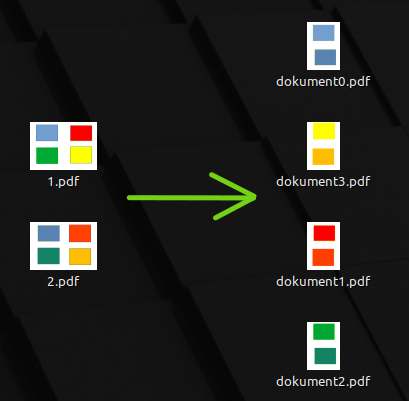
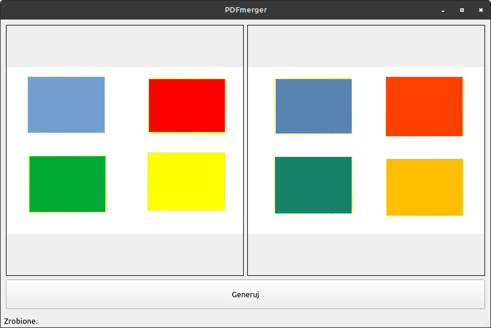

# About

Simple software written in python that splits two A3 scans to four A4 documents as shown below:



App appearance:



# Tips

You can change DPI and quality of jpeg conversion in "settings.ini".
Files "1.pdf" and "2.pdf" are for testing.

# Development

Preparing to development

## Environment setup

```
python -m venv <env-name>
```

## Environment activation on Windows

```
<env-name>\Scripts\activate
```

## Environment activation on Linux

```
source <env-name>\bin\activate
```

## Install dependencies

```
pip install -r requirements.txt
```

# Other

Windows version uses poppler package:
https://github.com/oschwartz10612/poppler-windows
